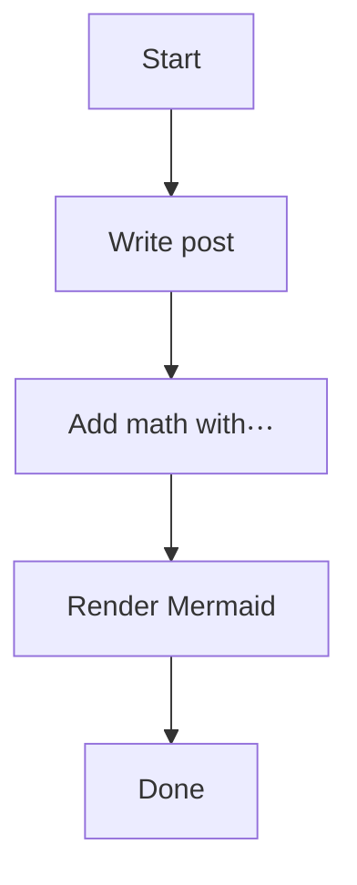

The purpose of this post is to ensure MathJax and Mermaid render properly

## MathJax

$$
\int_0^1 x^2\,dx = \frac{1}{3}
$$

$$
e^{i\pi} + 1 = 0
$$

$$
\norm{x}
$$

## Mermaid

```mermaid
graph TD
    A[Start] --> B[Write post]
    B --> C[Add math with $$...$$]
    C --> D[Render Mermaid]
    D --> E[Done]
```
